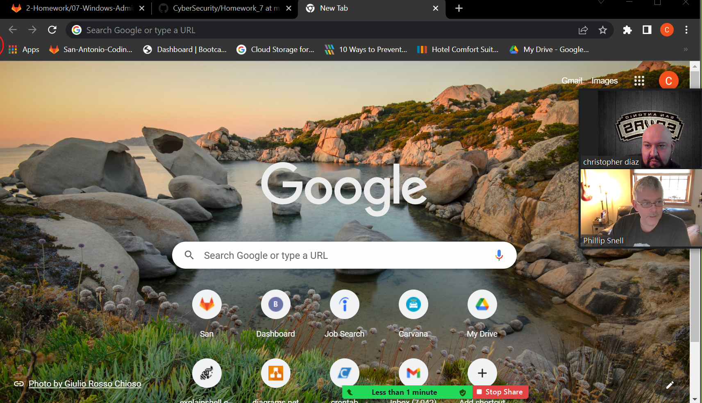

# CyberSecurity

Task 1: Create a GPO: Disable Local Link Multicast Name Resolution (LLMNR)
For this first task, you will investigate and mitigate one of the attack vectors that exists within a Windows domain. 

        Hello_world

Read about LLMNR vulnerabilities in the the MITRE ATT&CK database.

MITRE is one of the world's leading organizations for threat intelligence in cybersecurity.

MITRE maintains the Common Vulnerabilities and Exposures database, which catalogs officially known exploits.

It also maintains this MITRE ATT&CK database, which catalogs attack methods and signatures of known hacking groups.

Local Link Multicast Name Resolution (LLMNR) is a vulnerability, so we will be disabling it on our Windows 10 machine (via the GC Computers OU).
A few notes about LLMNR:

LLMNR is a protocol used as a backup (not an alternative) for DNS in Windows.

When Windows cannot find a local address (e.g. the location of a file server), it uses LLMNR to send out a broadcast across the network asking if any device knows the address.

LLMNR’s vulnerability is that it accepts any response as authentic, allowing attackers to poison or spoof LLMNR responses, forcing devices to authenticate to them.

An LLMNR-enabled Windows machine may automatically trust responses from anyone in the network.

Turning off LLMNR for the GC Computers OU will prevent our Windows machine from trusting location responses from potential attackers.

Instructions
Since this task deals with Active Directory Group Policy Objects, you'll be working in your nested Windows Server machine.
Create a Group Policy Object that prevents your domain-joined Windows machine from using LLMNR:

On the top-right of the Server Manager screen, open the Group Policy Management tool to create a new GPO.

Right-click Group Policy Objects and select New.

Name the Group Policy Object No LLMNR.

Right-click the new No LLMNR GPO listing and select Edit to open the Group Policy Management Editor and find policies.

In the Group Policy Management Editor, the policy you are looking for is at the following path: Computer Configuration\Policies\Administrative Templates\Network\DNS Client.

Find the policy called Turn Off Multicast Name Resolution.

Enable this policy.

Exit the Group Policy Management Editor and link the GPO to the GC Computers organizational unit you previously created.

Task 2: Create a GPO: Account Lockout
For security and compliance reasons, the CIO needs us to implement an account lockout policy on our Windows workstation. An account lockout disables access to an account for a set period of time after a specific number of failed login attempts. This policy defends against brute-force attacks, in which attackers can enter a million passwords in just a few minutes.
Account lockouts have some important considerations. Read about these in the following documentation:

Microsoft Security Guidance: Configuring Account Lockout
You only need to read the "Account Lockout Tradeoffs" and "Baseline Selection" sections.

To summarize, an overly restrictive account lockout policy (such as locking an account for 10 hours after 2 failed attempts), can potentially keep an account locked forever if an attacker repeatedly attempts to access it in an automated way.

Instructions
You'll be working within in your nested Windows Server machine again to create another Group Policy Object.
Create what you believe to be a reasonable account lockout Group Policy for the Windows 10 machine.

Name the Group Policy Object Account Lockout.

You can use Microsoft's 10/15/15 recommendation if you'd like.

When editing policies for this new GPO, keep in mind that you're looking for computer configuration policies to apply to your GC Computers OU. Also, these policies involve Windows security settings and accounts.

Don't forget to link the GPO to your GC Computers organizational unit.

Hint: If you're confused about where to find the right policies, check the instructions in italics.

Task 3: Create a GPO: Enabling Verbose PowerShell Logging and Transcription
As mentioned in a previous lesson, PowerShell is often used as a living off the land hacker tool. This means:

Once a hacker gains access to a Windows machine, they will leverage built-in tools, such as PowerShell and wmic, as much as possible to achieve their goals while trying to stay under the radar.

So why not just completely disable PowerShell?

Many security tools and system administration management operations, such as workstation provisioning, require heavy use of PowerShell to set up machines.

Best practices for enabling or disabling PowerShell are debated. This often leads to the solution of allowing only certain applications to run. These setups require a heavy amount of configuration using tools such as AppLocker.

This is why we're going to use a PowerShell practice that is recommended regardless of whether PowerShell is enabled or disabled: enabling enhanced PowerShell logging and visibility through verbosity.

This type of policy is important for tools like SIEM and for forensics operations, as it helps combat obfuscated PowerShell payloads.

Instructions
For this task, you'll be working in your Windows Server machine.
Create a Group Policy Object to enable PowerShell logging and transcription. This GPO will combine multiple policies into one, although they are all under the same policy collection.

Name the Group Policy Object PowerShell Logging.

Find the proper Windows Powershell policy in Group Policy Management Editor.

Hint: Check out the computer configuration, administrative templates, and Windows component directories.

Enable the Turn on Module Logging and do the following:

Click Show next to Module Names.

Since we want to log all PowerShell modules, enter an asterisk * (wildcard) for the Module Name, then click OK.

Enable the Turn on PowerShell Script Block Logging policy.

This policy uses the following template to log what is executed in the script block:

$collection = 
foreach ($item in $collection) {
    <Everything here will get logged by this policy>
}

Make sure to check the Log script block invocation start/stop events: setting.

Enable the Turn on Script Execution policy and do the following:

Set Execution Policy to Allow all scripts.

Note: Do you remember the Set-ExecutionPolicy cmdlet we ran during the PowerShell exercises? This policy can enforce those settings as part of a GPO.

Enable the Turn on PowerShell Transcription policy and do the following:

Leave the Transcript output directory blank (this defaults to the user's ~\Documents directory).

Note: "Transcription" means that an exact copy of the the commands are created in an output directory.

Check the Include invocation headers option. This will add timestamps to the command transcriptions.

Leave the Set the default source path for Update-Help policy as Not configured.

Link this new PowerShell Logging GPO to the GC Computers OU.

Note that the next time you log into your Windows 10 machine, run gpupdate. Then launch a new PowerShell window and run a script. You see verbose PowerShell logs created in the Windows 10 machine directory for the user that ran the script: C:\Users\<user>\Documents.
Speaking of scripts, your next task is to create a script.

Task 4: Create a Script: Enumerate Access Control Lists
Before we create a script, let's review Access Control Lists.

In Windows, access to files and directories are managed by Access Control Lists (ACLs). These identify which entities (known as security principals), such as users and groups, can access which resources. ACLs use security identifers to manage which principals can access which resources.

While you don't need to know the specific components within ACLs for this task, you do need to know how to use the Get-Acl PowerShell cmdlet to retrieve them. View Get-Acl documentation here.

Familiarize yourself with the basics of Get-Acls:

Get-Acl without any parameters or arguments will return the security descriptors of the directory you're currently in.

Get-Acl <filename> will return the specific file's ACL. We'll need to use this for our task.

Instructions
For this task, you'll be working in your nested Windows 10 machine with the following credentials: sysadmin | cybersecurity.
Create a PowerShell script that will enumerate the Access Control List of each file or subdirectory within the current working directory.

Create a foreach loop. You can use the following template:

foreach ($item in $directory) {
    <Script block>
}

Above the foreach condition, set a variable, $directory, to the contents of the current directory.

Replace the script block placeholder with the command to enumerate the ACL of a file, using the $item variable in place of the file name.

You'll need to use the following cmdlets:

Get-ChildItem (or any alias of Get-ChildItem, such as ls or dir)
Get-Acl

Save this script in C:\Users\sysadmin\Documents as enum_acls.ps1.

Test this script by moving to any directory (cd C:\Windows), and running C:\Users\sysadmin\Documents\enum_acls.ps1 (enter the full path and file name).

You should see the ACL output of each file or subdirectory where you ran the script from.

Bonus Task 5: Verify Your PowerShell Logging GPO
For this task we'll want to test and verify that our PowerShell logging GPO is working properly.

Instructions

Ensure you're logged into the Windows 10 machine as sysadmin |  cybersecurity.

Run gpupdate in an administrative PowerShell window to pull the latest Active Directory changes.

Close and relaunch PowerShell into an administrative session.

Navigate to a directory you want to see the ACLs in. You can go to C:\Windows, as you did in Task 4.

Run the enum_acls.ps1 script using the full file path and name such as the one in Task 4.

Check the C:\Users\sysadmin\Documents for your new logs.

You should see a directory with the current date (for example, 20200908) as the directory name. Your new transcribed PowerShell logs should be inside.

Submission Guidelines
Provide the following:

Deliverable for Task 1: Take a screenshot of all the GPOs created for this homework assignment. To find these, launch the Group Policy Management tool, select Group Policy Objects, and take a screenshot of the GPOs you've created.

Deliverable for Task 2: Submit a screenshot of the different Account Lockout policies in Group Policy Management Editor. It should show the three values you set under the Policy and Policy Setting columns.

Deliverable for Task 3: Submit a screenshot of the different Windows PowerShell policies within the Group Policy Management Editor. Four of these should be enabled.

Deliverable for Task 4: Submit a copy of your enum_acls.ps1 script.

Deliverable for Bonus Task 5: Submit a screenshot of the contents of one of your transcribed PowerShell logs or a copy of one of the logs.